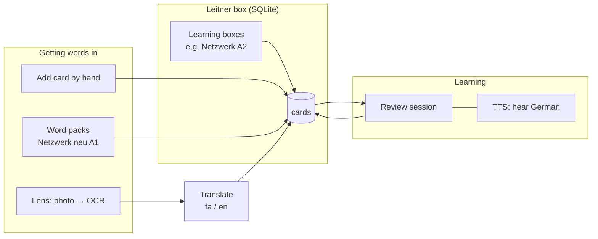
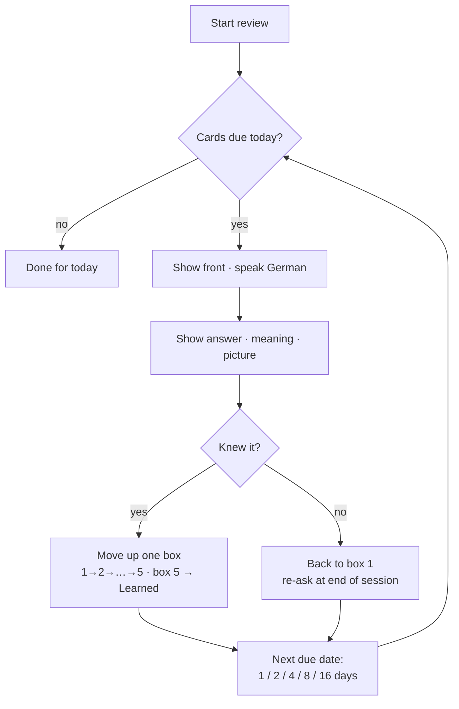
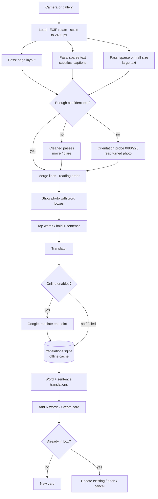

# LearningBox – How it works & Roadmap

A living document. **Tick a box (`- [x]`) when a step is done** and add a line to the
[Changelog](#changelog) at the bottom. Keep it next to the code so every `git push` publishes the
current state (GitHub/GitLab render the Mermaid charts below automatically).

Legend: `[x]` done · `[ ]` planned · 🧪 done but needs testing on a real phone

---

## 1. What the app does

A Leitner box for learning German words and sentences, with Persian or English meanings.
Qt 6.11 / C++20 / QML only (no Java). Android first, Windows/iOS later.

### 1.1 Leitner review

### 1.2 Lens: photo → words → cards

---

## 2. Modules — what lives where

| Area | File(s) | Job |
|---|---|---|
| App start | `main.cpp`, `qml/Main.qml` | Opens DB, Material style, toolbar (? help, ⚙ settings), page stack |
| Scheduling rules | `src/leitner.h` | Box intervals, promote / demote (pure, unit-tested) |
| Storage | `src/cardstore.*` (`CardStore`) | SQLite `learningbox.sqlite`, schema via `PRAGMA user_version` (v4: `collections`, v5: `reset_undo`), every query scoped to the selected learning box, add/update/delete, duplicates |
| Card model | `src/card.h`, `src/cardlistmodel.*` | Card struct, list model with search for *All cards* |
| Review | `src/reviewsession.*`, `qml/ReviewPage.qml` | Due queue, re-ask failed cards once, edit card, move to a box by hand |
| Box pages | `qml/BoxPage.qml`, `CardStore::cardsInBox / moveCard` | Cards per box, manual ◀ / ▶ moves, Undo |
| Speech | `src/speaker.*` (`Speaker`), `qml/SpeakButton.qml` | QTextToSpeech, German voice |
| Pictures | `src/cardimages.*` | Import, EXIF-rotate, scale to 1024 px, JPEG |
| Word packs | `src/wordpack.*`, `src/wordpacks.*`, `data/wordpacks/*.tsv` | A1 pack (597 words + Persian example translations), lookup by word / example, add chapter / add words |
| Example + translation | `qml/ExampleText.qml` | German example with Persian line (pack → saved → online) |
| OCR engine | `src/ocr/ocr.*`, `src/ocr/ocrtypes.h` | Tesseract passes, clean-up, merge, orientation |
| Word selection | `src/ocr/textselect.*` | Join words, re-join hyphenation, sentence range |
| Lens backend | `src/ocrengine.*` (`OcrEngine`) | Async recognition, display image, word list for QML |
| Online OCR | `src/cloudocr.*` (`CloudOcr`), `src/ocr/azureread.*` | Azure Read settings (endpoint + key), test, response parsing |
| Phone tilt | `src/devicetilt.*` (`DeviceTilt`) | Accelerometer → turn for the photo (Qt Sensors), pure rules unit-tested |
| Translation | `src/translator.*` (`Translator`), `src/translation/googletranslate.*` | fa/en setting, online/offline, SQLite cache, response parser |
| UI pages | `qml/HomePage`, `CardEditPage`, `CardListPage`, `LensPage`, `SettingsPage`, `WordPacks*`, `MeaningText` | Screens; `MeaningText` = per-line RTL/LTR |
| Help | `qml/HelpPage.qml`, `qml/HelpIcon.qml` | How to use the app, English / Persian (RTL); starts in the translation language |
| Camera for cards | `qml/CameraShotPage.qml`, `CardStore::cameraFilePath / importCameraShot` | Take a card picture, landscape turned upright |
| Send & get cards | `src/deckexchange.*`, `src/exchange/deckformats.*`, `qml/SendCardsPage.qml`, `qml/GetCardsPage.qml` | .lbox / CSV / Anki .apkg, links, into a new learning box, Android share sheet (JNI) |
| App mode + setup | `src/appmode.*` (`AppMode`), `qml/SetupPage.qml`, `qml/ModeComparison.qml` | Simple / Full, first-run setup |
| Starter words | `data/starter/starter_100.tsv`, `src/starterdeck.*`, `WordPacks::addStarterCards` | 100 words de / en / fa |
| Start over | `qml/ResetDialog.qml`, `CardStore::resetCollection / resetBox / undoReset` | All cards back to Box 1, spread, undo |
| Android | `android/AndroidManifest.xml`, `android/res/mipmap-*`, `3rdparty/android_openssl/` | TTS `<queries>`, camera permission, HTTPS libs, app icon |
| OCR libs | `3rdparty/` (Tesseract, Leptonica, cpu_features — downloaded, not committed), `data/tessdata/deu.traineddata` | Fetched + built per ABI by `build_ocr_android.cmd` |
| Build / deploy | `CMakeLists.txt`, `deploy.bat` | `deploy.bat` · `quick` · `log` · `watch` · `tts` |
| Tests | `tests/tst_*.cpp` | leitner, wordpack, cardimages, cardstore, cardstore_migrate, deckformats, deckexchange, textselect, ocr, ocrmerge, googletranslate, tatoeba, azureread, devicetilt |

**Data on the phone** (`AppDataLocation`): `learningbox.sqlite` (cards), `translations.sqlite` (cache),
`images/` (card pictures), `tessdata/` (OCR model copy). Settings via `QSettings`.

---

## 3. Status & roadmap

### Milestone 1 — Core Leitner + speech ✅
- [x] SQLite card store with schema versions
- [x] 5 boxes, intervals 1/2/4/8/16 days, Learned
- [x] Several learning boxes (e.g. per textbook): ComboBox with the first two shown, kept first and remembered across restarts; create / rename / delete 🧪
- [x] Start over: all cards (or one box) back to Box 1, optionally spread over N days and with statistics cleared; Undo 🧪
- [x] First-run setup: meaning language, **Simple or Full app** (switch later in Settings), 100 starter words 🧪
- [x] 100 starter words with English and Persian meanings and example sentences (offline fa / en switch) 🧪
- [x] Edit a card while reviewing it 🧪
- [x] Choose a card's box by hand: box chooser on the review card (moves it, next card comes) and in the editor 🧪
- [x] Review session (failed cards re-asked at the end)
- [x] Open each box, see its cards, move cards to the next / previous box (with Undo) 🧪
- [x] Delete a card by press-and-hold (Box pages, All cards) with confirmation 🧪
- [x] Add a card directly into a box (+ on the Box page; Box chooser in the editor) 🧪
- [x] Review: فارسی / English switch on the answer side; meaning and example follow it (translated when the card is in the other language) 🧪
- [x] Dictionary on Home: both directions, alternatives, examples, 🔊, add as card 🧪
- [x] Meaning language per learning box (Persian / English / German); English and German meanings and translations can be listened to 🧪
- [x] Learn English too: language per learning box, American voice, English OCR, English → Persian translation and examples 🧪
- [x] Review direction: German first / Meaning first (say the German word) / Mixed, remembered per learning box 🧪
- [x] Add / edit / delete / reset / search cards
- [x] German TTS
- [x] Persian text (RTL per line)
- [x] Pictures on cards (gallery or 📷 camera) 🧪
- [x] Word pack *Netzwerk neu A1* (12 chapters)
- [x] Persian translation of all 597 pack example sentences, shown under each example when Persian is selected 🧪
- [ ] English translations of pack examples (today: online/saved only)
- [x] Duplicate → ask *Update existing / Open / Cancel* (editor and Lens) 🧪

### Milestone 2 — Lens (OCR) ✅
- [x] Camera + gallery, offline Tesseract (German)
- [x] Tap words, hold for a sentence, pinch zoom
- [x] Screen photos (moiré clean-up) 🧪
- [x] Subtitles / text inside pictures (sparse pass + merge) 🧪
- [x] Sideways photos (orientation probe) 🧪
- [x] Handwriting: online recognition with Azure AI Vision Read, free F0 tier (own key), offline Tesseract fallback 🧪
- [x] Landscape shots like Google Lens: phone tilt (accelerometer) turns the photo upright before OCR 🧪
- [x] Camera re-created per shot (second photo bug) 🧪
- [x] Dependency check with download links (Tesseract / language data)
- [ ] Speed: weak/sideways photos take several seconds — measure on phone, tune passes
- [ ] Cut noise words on busy photos (UI icons, textures)
- [ ] Highlight words already in the box (blue = learning, green = learned) — *idea from Language Reactor*

### Milestone 3 — Translation ✅
- [x] Settings: Persian / English, online on/off
- [x] Online (Google endpoint) with offline cache; word-pack Persian as fallback
- [x] Whole-text, sentence and per-word translation in Lens
- [x] Card back = translation (Persian keeps the pack's meaning + grammar)
- [ ] Tap a word → popup with all meanings (alternatives are already fetched)
- [ ] Keep context on word cards: sentence + its translation as example, photo crop as picture
- [ ] Save a whole sentence as its own phrase card
- [ ] Replace the unofficial endpoint if it gets blocked (official API key, or LibreTranslate)

### Milestone 4 — Sentence suggestions
- [x] Suggest example sentences when adding a word: word pack (offline) + Tatoeba online, with translations 🧪
- [x] Word suggestions while typing + meaning filled in automatically (pack / saved / online) 🧪
- [ ] Offline German sentence corpus (Tatoeba download) in SQLite, for suggestions without internet

### Milestone 5 — Share & export flash cards
Goal: give a deck to another person and use it on their phone.
- [x] Export all cards or one box to one file (`.lbox` = zip: `cards.json` + `images/`), progress optional 🧪
- [x] Import `.lbox`, CSV/text (Quizlet, Excel, Anki text) and Anki `.apkg`, with preview and duplicate options 🧪
- [x] CSV export (Anki, Quizlet, Excel) 🧪
- [x] Import into a new learning box 🧪
- [x] Import from a link (Google Drive, Dropbox, GitHub links converted to direct downloads) 🧪
- [x] Clearer Send / Get pages with a hint under every choice 🧪
- [x] Android share sheet directly from the app (send via WhatsApp, Telegram, e-mail …) 🧪
- [ ] "Open with LearningBox" for received files
- [ ] Anki `.apkg` in the newest format (zstd) and Anki media in the new binary format
- [ ] Share by QR code or link (needs online storage, see M6)

### Milestone 6 — Online backup & sync
Goal: cards and progress saved online, same state on every device.
- [ ] Choose backend (no Java, plain HTTPS/REST from Qt): e.g. Supabase / Firebase REST, WebDAV (Nextcloud), or own small server
- [ ] Account / sign-in
- [ ] Backup & restore (whole DB + images)
- [ ] Two-way sync with `updated_at` per card, conflict rule = newest wins
- [ ] Online progress view (cards per box, reviews per day)

### Milestone 7 — Help, polish, platforms
- [x] Built-in help in English and Persian (? icon on every page, language switch) 🧪
- [ ] German help text
- [ ] Dependency checker for all third-party parts (TTS voice, OCR data, network)
- [ ] App icon, splash, release signing, Play Store listing
- [ ] Windows build (Phase 2)
- [ ] iOS build (Phase 2)

### Project progress online
Goal: this roadmap and the app version are visible online after each push.
- [ ] Put the repo on GitHub (private or public) — `ROADMAP.md` and `README.md` render there, including Mermaid
- [ ] GitHub Actions: build + run unit tests on each push (badge in README)
- [ ] Optional: GitHub Pages site generated from `ROADMAP.md` + latest APK as a release asset
- [ ] Version number + changelog per release

---

## 4. Known issues
- Lens needs a few seconds on weak/sideways photos (several OCR passes).
- Photos of monitors are harder than paper; best: straight on, not too close.
- Google endpoint is unofficial and rate-limited (fine for personal use).
- Android shows "pasted from your clipboard" when a text field gets focus (Qt behaviour).

---

## Changelog
| Date | Change |
|---|---|
| 2026-10-04 | Speech speed control and its test button removed (review card, Settings): TTS always uses the default speed |
| 2026-09-29 | Dictionary page (last item on Home); speed control removed from Home; fix: choosing Persian / English in Settings did not stick |
| 2026-09-29 | Meaning language chosen per learning box (fa / en / de, schema v7); 🔊 for English and German meanings, example and Lens translations |
| 2026-09-29 | Learning English: language per learning box (schema v6), American English voice, English OCR (eng.traineddata), English → Persian translation and Tatoeba examples, flags in the chooser; speech speed on the review card (remembered) |
| 2026-09-29 | Review direction: German first, Meaning first or Mixed (per learning box) |
| 2026-09-29 | First-run setup (Simple / Full app), 100 starter words (de / en / fa), start over with undo, Send / Get pages with hints and share sheet; schema v5 |
| 2026-09-29 | README: *Dependencies & downloads* with links for tools, libraries, services and the phone voice; in-app links: exact Tesseract / deu.traineddata downloads (Lens), German voice on Google Play (Home) |
| 2026-09-29 | Repo clean-up: OCR sources downloaded by the build script instead of committed, emulator OpenSSL not committed, unused Figma `importedcontent` removed |
| 2026-09-29 | App icon: Achaemenid Shahbaz standard (adaptive icon, round + legacy), source `assets/icons/app_icon.png` |
| 2026-09-29 | Help page (English / Persian) with ? icon next to settings; box tiles fade blue → green; learning-box name no longer highlighted |
| 2026-09-29 | Review: box chooser (move the card by hand), pencil icon drawn (✎ missing on Android); editor: box chooser for existing cards |
| 2026-09-28 | Home: learning boxes in a ComboBox (two shown, selected name highlighted), original box tiles; edit card during review; take a card picture with the camera |
| 2026-09-28 | Learning boxes: several collections on Home (new / rename / delete, selected on top in yellow-green, remembered); import into a new learning box; schema v4 |
| 2026-09-28 | Lens: online handwriting recognition with offline fallback — switched from Google Cloud Vision to Azure AI Vision (free F0, no charges) |
| 2026-09-28 | Lens: landscape shots via phone tilt (Qt Sensors), rotation hint into OCR, fallback probe incl. 180° |
| 2026-09-28 | Import & export: .lbox, CSV, Anki .apkg, from file or link |
| 2026-09-28 | Card editor: word suggestions, automatic meaning, example suggestions (pack + Tatoeba) |
| 2026-09-28 | Review: language switch on the answer side; example translations in English too; delete via press-and-hold; per-button ⏹ |
| 2026-09-28 | Box pages: open a box, list its cards, move them between boxes |
| 2026-09-28 | Persian translations for all 597 word-pack examples (5th TSV column), `ExampleText` in review, pack preview and editor |
| 2026-09-27 | Lens translation (fa/en, online + offline cache), Settings page, duplicate dialog, OCR: moiré, subtitles, merge, orientation; `deploy.bat`; `.gitignore`; this roadmap |
